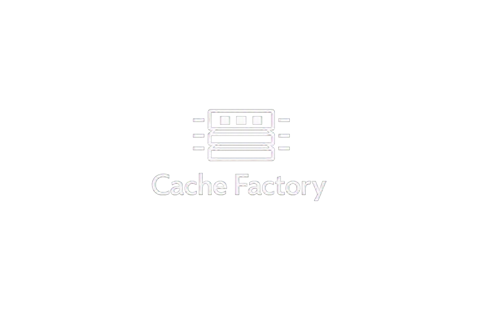
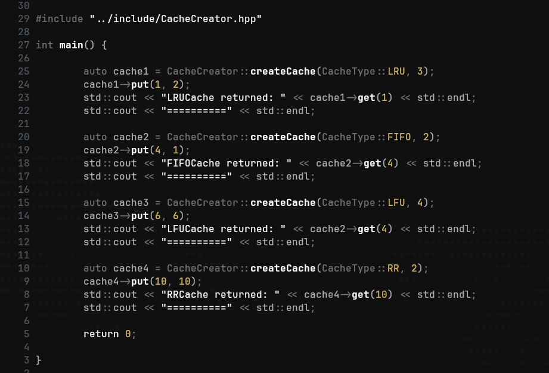
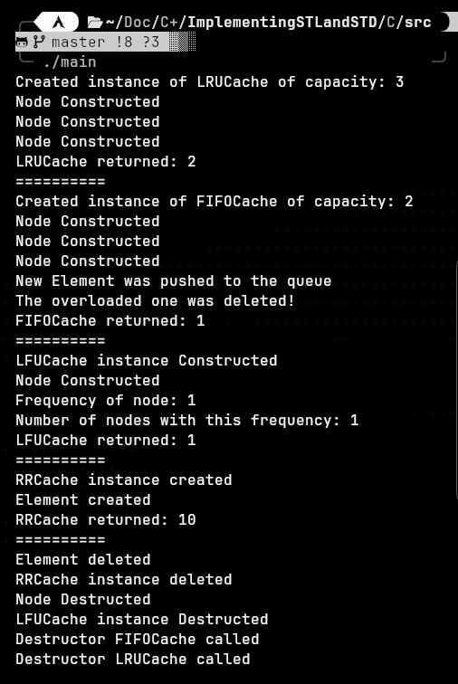

<p align="center">
  
</p>
<p align="center">
  Cache Factory made with C++20.
</p>

---

## Design Choices and Goals

This is an educational project created for inclusion in my CV.
I was inspired to do this project after reading the book *OSTEP*.
The main goal was to understand how different cache policies works under the hood
and used Factory Design Pattern to make a convinient API for other programmers.

---

## Showcase

<p align="left">
  
  
</p>

---

## Requirements

- **OS:** Linux  
  Developed and tested on Arch Linux

- **Compiler:** GCC with C++20 support

- **Build system:** Make

---

## Clone and Build

```bash
git clone https://github.com/Majkii2006/CacheFactory.git
```

Then configure and build the project:

```bash
make build
```
Then run executable or do it by:
```bash
make run
```
---
  
## License

Licensed under the Apache License, Version 2.0.  
See the [LICENSE](LICENSE) and [NOTICE](NOTICE) files for details.
